## YUV介绍

有两种表示方法

1. Y表示明亮度，即灰阶值，如果只看Y，图案是黑白的。U表示色调，V表示饱和度。
2. Y表示明亮度，Cb表示蓝色分量，Cr表示红色分量。

使用不同采样的原因，是为了压缩空间，完整采样每像素点需要24bits，而YUV420采样每像素点只要12bits。并且人眼对亮度分量（Y）比较敏感，而对色度分量（UV）相对不敏感，因此可以降低UV的采样。

通常每个分量的采样深度都为8bit，但是也有10bit的形式，需要注意，虽然是按10bit采样，但是实际空间是按16bit占用。

### YUV 4:4:4

YUV 4:4:4表示全采样，每个像素点占用24bits。

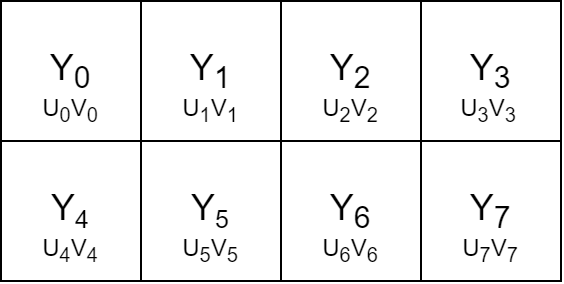

#### yuv444p

Planar形式，即平面模式，按YYYYUUUUVVVV或YYYYVVVVUUUU的顺序依次排布

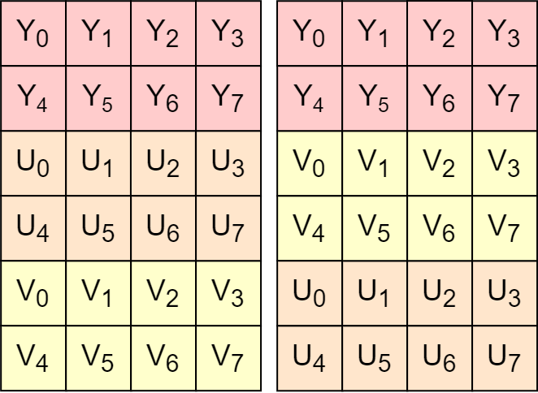

#### yuv444sp

Planar Interlaced形式，即平面交织模式，按YYYYUVUVUVUV或YYYYVUVUVUVU的顺序排布

#### yuv444 packed

Packed形式，按YUVYUVYUVYUV的顺序排布

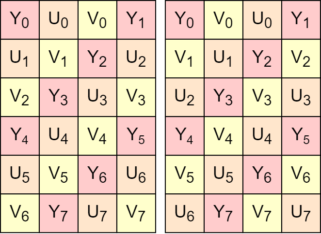

### YUV 4:4:0

水平方向全采样，垂直方向交替2:1采样。下图仅列出一种情况，即奇数行采YUV，偶数行采Y。还有可能有奇数行采YU，偶数行采YV等情况，取决于芯片内部处理，最终占用的内存一致，显示图像的方法也一致。

#### yuv440p

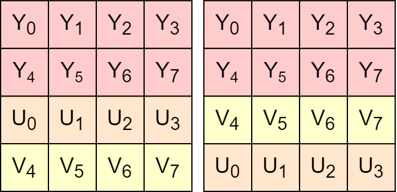

#### yuv440sp

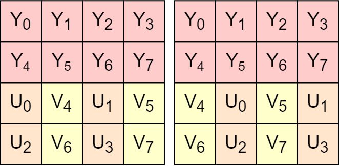

#### yuv440 packed

### YUV 4:2:2

水平方向2:1采样，垂直方向全采样。或理解为Y分量全采样，UV分量每2点采一个。

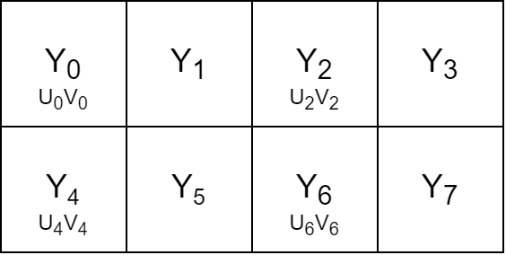

#### yuv422p

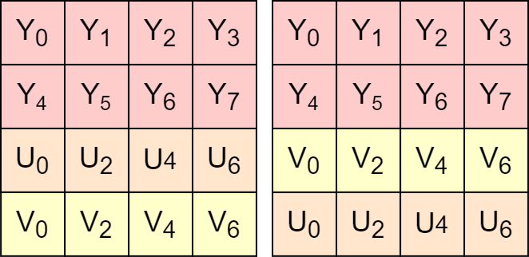

#### yuv422sp

下图一别称NV16，下图二别称NV61

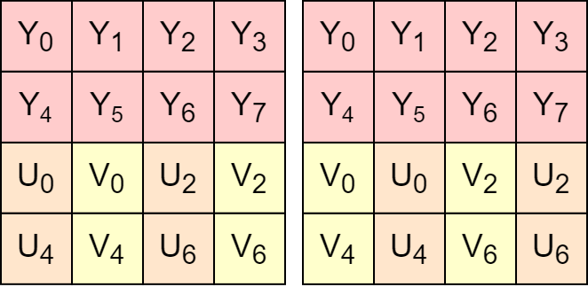

#### yuv422 packed

下图一别称YUY2

### YUV 4:2:0

水平方向2:1采样，垂直方向2:1采样。除图示外，还可能有隔行采样，奇数行采YUV，偶数行采Y，或隔行隔列采样等。

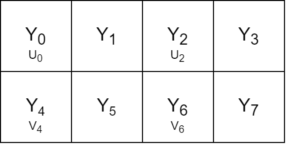

#### yuv420p

下图一别称YU12/I420，下图二别称YV12

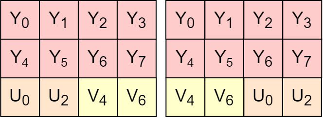

#### yuv420sp

下图一别称NV12，下图二别称NV21

#### yuv420 packed

下图别称Y41P/Y411

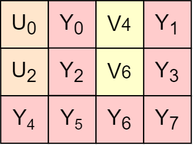

### YUV 4:1:1

水平方向4:1采样，垂直方向全采样。

#### yuv411p

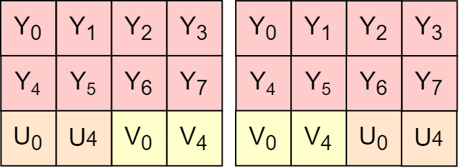

#### yuv411sp

### YUV 4:1:0

水平方向4:1采样，垂直方向2:1采样。

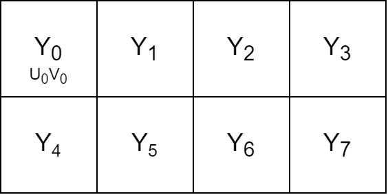

#### yuv410p

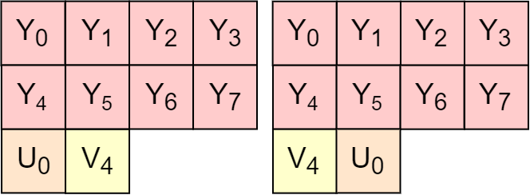

### YUV 4:0:0

仅采Y分量。

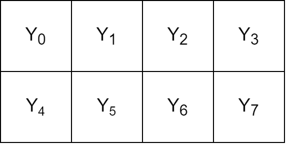

#### yuv400p

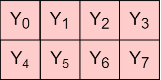

## RGB介绍

RGB分为Red, Green, Blue三个分量，按需要可能有A（Alpha）分量。RGB分为两大类，一类为索引形式，一类为像素形式。

1. 索引形式

   有RGB1，RGB4，RGB8等形式。通常存在一索引表（调色盘），RGBn的索引表大小为2^n，以RGB1为例，仅有两色（如黑和白），则数据中的0即表示白色，1表示黑色，如点阵字库就可以认为是RGB1。RGB8则包含256种颜色，注意颜色不一定连续，并且索引表的大小可能是32bit的，因此在色彩不超过256色的情况下，RGB8索引色与ARGB32表示的图像是一致的，但是RGB8占用的空间可能比ARGB32小很多（RGB8为256 * 4 + w * h，ARGB32为w * h * 4）。

2. 像素形式

   按照不同分量占用的比特数以及不同的排列顺序，可以分为RGB332，RGB555，RGB565，RGB888(RGB24)，ARGB8888（RGB32）等。

### RGB332

R:3bits, G:3bits, B:2bits，每个像素点占用1字节

### RGB565

R:5bits, G:6bits, B:5bits，每个像素点占用2字节。还有BGR565等形式

### RGB555

R:5bits, G:5bits, B:5bits，每个像素点占用2字节，最高位数据忽略

### RGB24

RGB888，R:8bits, G:8bits, B:8bits，每个像素点占用3字节。还有BGR888等形式

### RGB32

ARGB8888，A:8bits, R:8bits, G:8bits, B:8bits，每个像素点占用4字节。还有RGBA32，ABGR32，BGRA32，RGBX32，BGRX32，XRGB32，XBGR32等形式

### DRM中的定义

RG16/RGB565：

BG16/BGR565：

RG24/RGB888：

BG24/BGR888：

AR24/ARGB8888：

XR24/XRGB8888：

AB24/ABGR8888：

XB24/XBGR8888：

RA24/RGBA8888：

RX24/RGBX8888：

BA24/BGRA8888：

BX24/BXGR8888：

